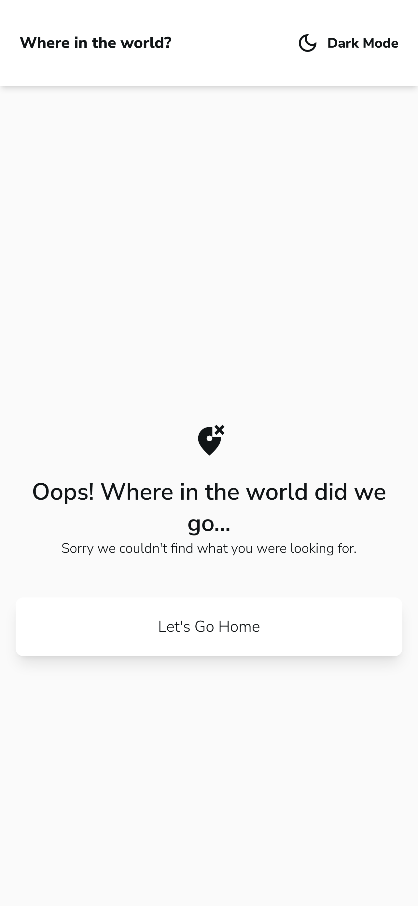

# Frontend Mentor - REST Countries API with color theme switcher solution

This is a solution to the [REST Countries API with color theme switcher challenge on Frontend Mentor](https://www.frontendmentor.io/challenges/rest-countries-api-with-color-theme-switcher-5cacc469fec04111f7b848ca). Frontend Mentor challenges help you improve your coding skills by building realistic projects.

## Table of contents

- [Overview](#overview)
  - [The challenge](#the-challenge)
  - [Links](#links)
  - [Screenshots](#screenshots)
- [My process](#my-process)
  - [Built with](#built-with)
  - [What I learned](#what-i-learned)
  - [Useful resources](#useful-resources)
- [Author](#author)

**Note: Delete this note and update the table of contents based on what sections you keep.**

## Overview

### The challenge

Users should be able to:

- See all countries from the API on the homepage
- Search for a country using an `input` field
- Filter countries by region
- Click on a country to see more detailed information on a separate page
- Click through to the border countries on the detail page
- Toggle the color scheme between light and dark mode _(optional)_

I've added some minor additions that weren't included in the initial design:

- Custom 404 page
- Skeleton loading on Main page and Details page
- Link to Google Maps for country on Details page
- Include Currency symbol in addition to Currency Name
- I assumed that clicking on any of the existing Border Countries on the Details page should direct the user to that specific Country Details page
- Input keyword and/or Region dropdown along with the filtered results persist when navigating from the Details page -> Main page via Back button

### Links

- Solution URL: [https://github.com/philliplam8/Countries-API-app-challenge](https://github.com/philliplam8/Countries-API-app-challenge)
- Live Site URL: [https://countries-api-app-challenge.vercel.app/](https://countries-api-app-challenge.vercel.app/)

### Screenshots

#### Desktop

#### Mobile

## My process

### Built with

- Semantic HTML5 markup
- CSS custom properties
- Flexbox
- Mobile-first workflow
- [React](https://reactjs.org/) - JS library
- [Next.js](https://nextjs.org/) - React framework
- [TailwindCSS](https://tailwindcss.com/) - For styles
- [HeadlessUI](https://headlessui.com/react/menu) - For Dropdown styling
- [MaterialUI](https://mui.com/material-ui/) - For Skeleton loading component and icons

### What I learned

Tried out TailwindCSS for the first time and was skeptical about relying on inline CSS, however my opinion has changed. Before TailwindCSS, I would usually go down the rabbit hole of creating multiple `
` tags that would wrap around a component for the sole purpose of adding a CSS class. This is not so bad if you can reuse those CSS classes and if it allows you to have consistency and keep things DRY.

The problem with this emerges when you need a _slight different_ styling variant and end up creating a whole new CSS class to accomodate for this variant. Eventually I find myself bloating my CSS files with numerous classes.

With Tailwind, while it seems like the bloat is transfered from the typical CSS files into lines within your JSX code, I found it was easier to accodomate for these _slight_ variants since the CSS was scoped locally. It was also easier to debug styling issues since it was already inline. This combined with the inuitive Tailwind classnames and documentation, I oddly found myself enjoying CSS because now it was just so easy to use.

### Useful resources

- [TailwindCSS Documentation](https://tailwindcss.com/docs/) - This helped me write inline CSS a lot quicker using their inuitive class names.
- [UI Libraries Explanation by "Theo - ping.gg"](https://www.youtube.com/watch?v=CQuTF-bkOgc) - While using TailwindCSS, I encountered this Youtube video, which did a great job outlining the current state of UI libraries, along with their ideal use cases and bottlenecks.

## Author

- Frontend Mentor - [@philliplam8](https://www.frontendmentor.io/profile/philliplam8)
